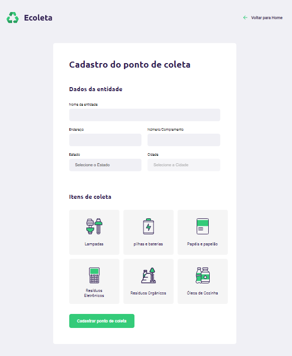

# Next Level Week
### Anotações sobre a aula 01:

#### Box Models
* Modelo de Caixa, todas tem:
   * Largura
   * Altura
   * Espaçamento
   * Preenchimento
   * Borda
   * Cor
   * Fundo
   * Display - Maneira que é vista pelo html
   * Alinhamento
   * Posicionamento
---
Pixel é uma unidade de medida fixa  
Interessante usar:  
`width: 100%;` - valor ajustavel 
`max-width: 360px` - valor fixo

---

* No DevTools, ao clicar em uma TAG, e em Styles, tem um campo chamado: 
   * `element.style {}` - Se digitar uma funcionalidade, atualiza na hora para ver as alterações.
* `display: Flex;` - coloca um elemento ao lado do outro, dentro da caixa.
   * `align-items: center` - alinha os itens da flex na mesma linha 
   * `justify-content: space-between` - espaçamento entre os conteudos
   * `flex-direction: column` - Poe em colunas, um embaixo do outro
      * `flex: 1;` - crescimento
* No CSS: `:root { --title-color: #322153 }` - Define uma variavel com essa cor.
   * `color: var(--title-color)`
* `border-top-left-radius: 8px`
* Se adicionar uma imagem no `` tem que definir `width` e `height` 
**Alinhar com Posição Absoluta:**  
* `position: absolute;` 
* `left:50%;`
* `transform: translateX(-50%)`
---
### Anotações sobre a aula 02:
* [IBGE serviços API](https://servicodados.ibge.gov.br/api/docs)
* `<form>`
* `<fieldset>` -> `<legend>`
* `<label for="nome">` - o for referencia ao name
* `<input type="text" name="nome">`
   * `outline: none` - NO CSS, para tirar a linha em volta, ao selecionar o input
* `<select name="" disabled>` - cria um dropdown desabilitado(não é possivel clicar)
* `<option value="">` - opçoes do  dropdown
* Para criar uma referencia, tem q por ${} entre **CRASES**

#### EMET
* `.field*2`  = Cria 2 campos div com class field
* `label+input` = Cria uma label e do lado um input
* `form .field-group .field + .field` - Referencia ao segundo field
* `li>img>span` - Cria um `span` dentro de um `img`, tudo dentro de um `li`

#### JavaScript
`document.write("Hello World")` - Escreve na tela  
`var` / `let` / `const`  
**Objeto:** - `const pessoa = { altura: "1,80m", idade: 24, solteiro: true, correr(){ return "run Forest" }}`  
**Acessar um objeto** - `document.write(pessoa.altura)`  
**Array** - `const colecao = ["blue", "green", 1]` = Coleção de dados 
**Função** - `function saymyname () { document.write("Gabriel")}` = Atalho, reuso de codigo...  
**Condicionais** - `if(boolean){ } else { }`  
**Repetições/ loop** - `for(i = 0; i < 10; i++){document.write('${i}')}`  
`console.log()`- Escreve no console do DevTools(f12)  
**Função Anônima** - `() => {}` ou `function() { console.log() }`  
`querySelector("input")` - Procura alguma coisa, exemplo, o primeiro input  
`querySelectorAll("input")` - Procura TODOS input  
**For Each** - `for(const state of states)` - para cada variavel estado de estado...

### Anotações sobre a aula 03:
**flex** - unidimencional, ou fica tudo um do lado do outro, ou tudo embaixo do outro.  
**grid** - multidimencional, cria linhas e colunas
* `display: grid`
* `grid-template-columns: 1fr 1fr 1fr` - Cria tres colunas com 1fr
   * `fr` = fração, ele mesmo calcula (_flexivel_)
* `gap: 16px` - separa os grid em 16px
* **Alpha no Hexadecimal:** - `#f5f5f5aa` - mais duas letras/numeros apos o hexadecimal

### Anotações sobre a aula 04:
* Baixando o **Node JS**
* No Git Bash, digitar `node` para entrar no terminal do node
* **Comandos:**
   * `console.log()`
   * `.exit`
   * `npm install express` - para criar um servidor
